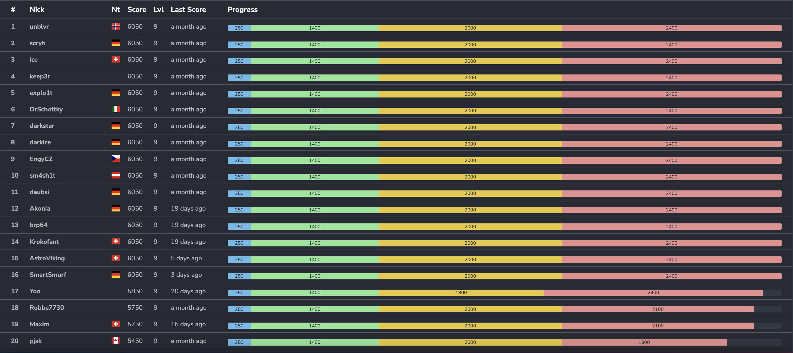
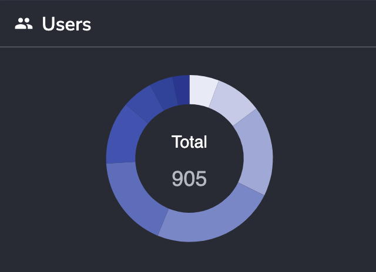
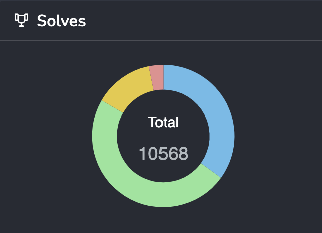

# HackyEaster 2022

## Thank You
First, a big thank you to the volunteers (otaku, ice, daubsi), and all supporters that bought one or more [Ko-Fi](https://ko-fi.com/hackyeaster)!

## Challenges
You can find all challenges, including sources, dockerfiles, solution, etc. in the challenges/ folder.

## Write-Ups
The following write-ups have been written (contact me at hackyeaster@gmail.com if you want yours to be added):
- [ice (GitHub)](https://github.com/InverseIntegral/ctf_writeups/tree/master/hackyeaster_2022#hacky-easter-2022)
- [verath (GitHub)](https://github.com/verath/hacky-easter-22)
- [evandrix (GitHub)](https://github.com/redstang33/CTF/tree/main/hacky-easter-2022)

## Ph1n1sh3rs
The following players have beaten all levels and got rewarded with a "Ph1n1sh3r" badge. Congrats!

unblvr, scryh, ice, keep3r, explo1t, DrSchottky, m4ttm00ny, darkstar, darkice, EngyCZ, sm4sh1t, pjsk, daubsi, neil, jayden, Robbe7730, Yoo, cyberdemon, Akonia, brp64, Krokofant, Maxim, Maxou, Kaythen, AstroViking, test123, bcluyse, evandrix, sploutchy, SmartSmurf

## Perfect solvers
The following Ph1n1shers also managed to solve **all** challenges.

Ordered by time: unblvr, scryh, ice, keep3r, explo1t, DrSchottky, darkstar, darkice, EngyCZ, sm4sh1t, daubsi, Akonia, brp64, Krokofant, AstroViking, SmartSmurf

## Survey Results
[Hacky Easter 2022 Survey Results.pdf](docs/Hacky%20Easter%202022%20Survey%20Results.pdf "Survey Results PDF")

## Top 20

## Stats
### Players
| players | count |
| :- | -: |
| ph1n1sh3r (level 9) | 30 |
| level 8 | 41 |
| level 7 | 54 |
| level 6 | 110 |
| level 5 | 161 |
| level 4 | 217 |
| level 3 | 158 |
| level 2 | 82 |
| level 1 | 52 |
| **total** | 905 |

### Solves
| solves | count |
| :- | -: |
| noob | 3697 |
| easy | 5112 |
| medium | 1416 |
| hard | 343 |
| **total** | 10568 |

